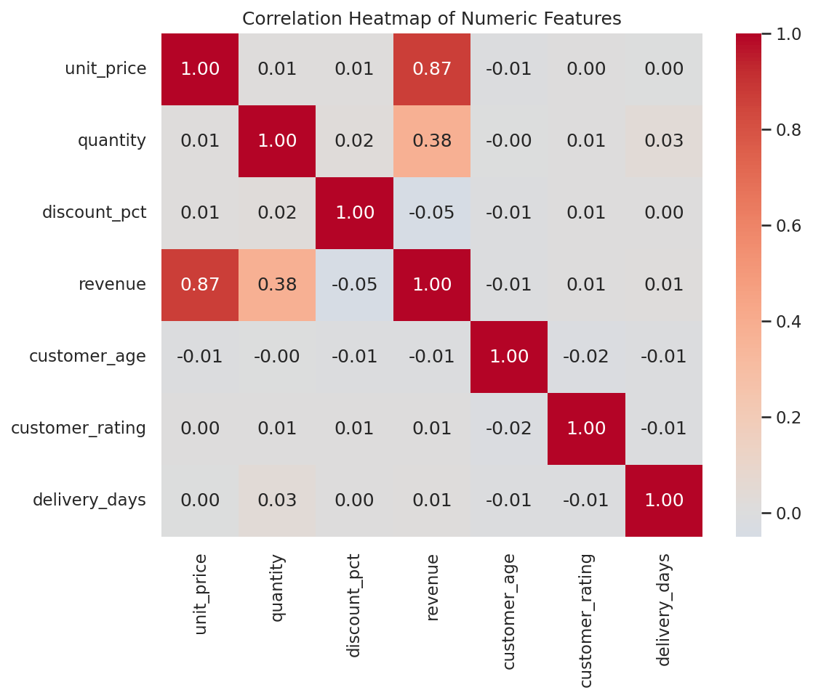
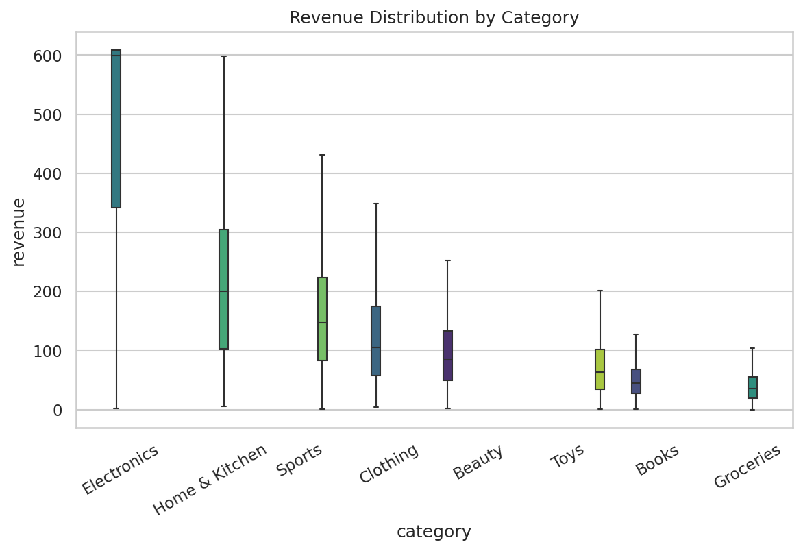
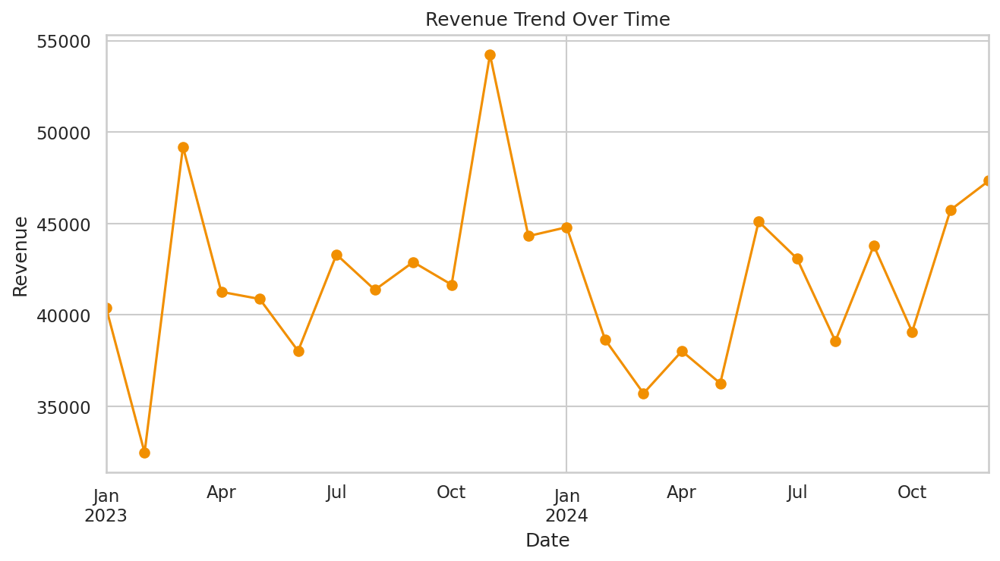

# 📊 EDA Analytics Suite

A production-ready, end-to-end **Exploratory Data Analysis** system: automated data cleaning, statistical analysis, anomaly detection, hypothesis testing, plain-English insights, multi-format reporting (Markdown/PDF/Excel/CSV), a full chart suite, and an interactive Streamlit dashboard — all driven from one shared `src/` codebase via either a CLI or a UI.

Built as a portfolio-quality project suitable for a resume, GitHub, data analyst interviews, or a final-year showcase.

---

## Table of Contents

- [Overview](#overview)
- [Features](#features)
- [Architecture](#architecture)
- [Workflow](#workflow)
- [Installation](#installation)
- [Usage](#usage)
- [Screenshots](#screenshots)
- [Output](#output)
- [Folder Structure](#folder-structure)
- [Tech Stack](#tech-stack)
- [Testing](#testing)
- [Future Scope](#future-scope)
- [License](#license)

---

## Overview

You give it a dataset (CSV, Excel, or JSON). It gives you back:

- A **cleaned dataset**, with a full report of every change made.
- A **statistical picture** of the data — distributions, correlations, feature relationships, skew/kurtosis.
- **Anomalies**, found three different ways (IQR, Z-score, Isolation Forest) so you can see where the methods agree and where they don't.
- **Formal hypothesis tests** (ANOVA, t-test, chi-square, correlation significance), each with a plain-English conclusion.
- **Ten+ chart types**, saved automatically.
- **Plain-English insights and recommendations**, generated from the actual data — not templated boilerplate.
- A **professional report** in Markdown, PDF, Excel, and CSV — all from one shared set of content, so they never drift out of sync.
- An **interactive dashboard** for exploring any of the above without touching the command line.

Everything is defensive by design: bad files, missing columns, and datasets that don't match the sample schema are handled gracefully instead of crashing the pipeline.

---

## Features

**Data Cleaning** — duplicate removal, missing-value imputation, dtype correction (e.g. `"$1,200"` → `1200.0`), date parsing, IQR-based outlier capping/removal, and vectorized memory optimization (dtype downcasting + categorical conversion).

**Exploratory Analysis** — structural overview, missing-value and duplicate reports, numeric summary statistics, categorical breakdowns, correlation matrix, skewness/kurtosis, and grouped feature relationships.

**Visualization** — histograms, box plots, violin plots, a correlation heatmap, a pair plot, scatter plots, count plots, pie charts, aggregated bar charts, and time-series trend lines. Every chart skips gracefully if its required columns aren't in the dataset.

**Anomaly Detection** — IQR, Z-score, and Isolation Forest, compared side by side, plus a separate layer of business-rule sanity checks (e.g. ratings outside 1–5).

**Hypothesis Testing** — one-way ANOVA, Welch's t-test, chi-square test of independence, and Pearson correlation significance, each auto-explained.

**Automated Insights** — best/worst category performance, strongest correlations, time-trend direction, and data-quality flags, written in plain English.

**Multi-Format Reporting** — Markdown, PDF (ReportLab, auto-wrapping tables), Excel (one sheet per table), and a combined long-format CSV summary.

**Interactive Dashboard** — upload your own dataset, filter it, toggle cleaning on/off, browse every chart type, compare anomaly-detection methods, run hypothesis tests, read insights, and download reports — with dark-theme support.

**Production Concerns** — structured logging with execution timing per stage, a CLI with multiple modes, robust error handling (missing/empty/corrupted/unsupported files), and a pytest suite covering every module.

---

## Architecture

```
┌─────────────┐     ┌──────────────┐     ┌───────────────┐
│  CLI         │     │  Dashboard   │     │   (any script) │
│  main.py     │     │ dashboard.py │     │  imports src/  │
└──────┬──────┘     └──────┬───────┘     └───────┬───────┘
       └────────────────────┴──────────────────────┘
                             │
                   ┌─────────▼─────────┐
                   │      src/          │
                   │  data_loader        │  ← load & validate
                   │  data_cleaner        │  ← clean & report
                   │  data_explorer        │  ← structural EDA
                   │  anomaly_detector      │  ← IQR / Z-score / IsoForest
                   │  hypothesis_tester      │  ← ANOVA / t-test / chi² / corr
                   │  visualizer              │  ← chart suite
                   │  insights_generator        │  ← plain-English findings
                   │  report_generator            │  ← MD / PDF / Excel / CSV
                   │  logger_config                │  ← logging + timing
                   └─────────────────────┘
                             │
                   ┌─────────▼─────────┐
                   │     config.py       │  ← single source of truth
                   └─────────────────────┘
```

Every module in `src/` is independent and testable in isolation; `main.py` and `dashboard.py` are both thin orchestration layers over the same modules, so behavior never diverges between the CLI and the UI.

---

## Workflow

```
Load  →  Clean  →  Explore  →  Detect Anomalies  →  Test Hypotheses
  →  Visualize  →  Generate Insights  →  Compile Reports
```

Each stage is independently timed and logged (see `output/logs/eda_project.log`), and a failure in one chart or one hypothesis test doesn't take down the rest of the pipeline.

---

## Installation

**Requirements:** Python 3.9+

```bash
# Clone or unzip the project, then:
cd eda-analytics-suite

# (Recommended) create a virtual environment
python3 -m venv venv
source venv/bin/activate        # Windows: venv\Scripts\activate

# Install dependencies
pip install -r requirements.txt
```

Or, on Windows, just run `run.bat`; on macOS/Linux, run `./run.sh` — both install dependencies and run the full pipeline in one step.

---

## Usage

### Command line

```bash
python main.py                          # run everything with defaults
python main.py --dataset your_file.csv  # analyze your own dataset
python main.py --charts                 # charts only
python main.py --report                 # reports only
python main.py --skip-clean             # analyze raw data, no cleaning stage
python main.py --no-pdf --no-excel      # limit report formats
```

Full flag reference: [`docs/cli.md`](docs/cli.md)

### Interactive dashboard

```bash
streamlit run dashboard.py
```

Then open `http://localhost:8501`. Full feature list: [`docs/dashboard.md`](docs/dashboard.md)

### As a library

```python
from src.data_loader import DataLoader
from src.data_cleaner import DataCleaner
from src.visualizer import EDAVisualizer

df = DataLoader("data/raw/sample_dataset.csv").load()
df = DataCleaner(df).run_full_cleaning().get_cleaned_data()
EDAVisualizer(df, output_dir="output/charts").generate_all()
```

Every module has its own doc page in [`docs/`](docs/README.md).

---

## Screenshots

| Correlation Heatmap | Revenue by Category | Revenue Trend |
|---|---|---|
|  |  |  |

These are generated automatically by `python main.py --charts` against the bundled sample dataset — every chart type (heatmap, box/violin, pair plot, scatter, count, pie, bar, trend) is produced the same way from any dataset you provide.

The Streamlit dashboard (`streamlit run dashboard.py`) provides the same charts interactively, plus filters, summary cards, and report downloads — see [`docs/dashboard.md`](docs/dashboard.md) for the full feature walkthrough.

---

## Output

Running `python main.py --all` produces:

```
output/
├── charts/
│   ├── revenue_distribution.png
│   ├── revenue_by_category_boxplot.png
│   ├── revenue_by_category_violin.png
│   ├── correlation_heatmap.png
│   ├── pairplot.png
│   ├── customer_age_vs_customer_rating_scatter.png
│   ├── region_countplot.png
│   ├── payment_method_pie.png
│   ├── revenue_sum_by_category_bar.png
│   └── revenue_trend.png
├── reports/
│   ├── eda_report.md
│   ├── eda_report.pdf
│   ├── eda_report.xlsx
│   └── eda_summary.csv
└── logs/
    └── eda_project.log
```

Plus a cleaned copy of your dataset at `data/processed/cleaned_dataset.csv`.

---

## Folder Structure

```
eda-analytics-suite/
├── config.py                  # centralized paths & settings
├── main.py                    # CLI entry point
├── dashboard.py                # Streamlit dashboard
├── requirements.txt
├── pytest.ini
├── run.bat / run.sh
├── .gitignore
├── LICENSE
├── data/
│   ├── raw/                    # input datasets
│   ├── processed/               # cleaned datasets
│   └── generate_dataset.py       # synthetic sample-data generator
├── src/
│   ├── data_loader.py
│   ├── data_cleaner.py
│   ├── data_explorer.py
│   ├── anomaly_detector.py
│   ├── hypothesis_tester.py
│   ├── visualizer.py
│   ├── insights_generator.py
│   ├── report_generator.py
│   └── logger_config.py
├── output/
│   ├── charts/
│   ├── reports/
│   └── logs/
├── docs/                        # per-module documentation
│   └── screenshots/
└── tests/                       # pytest suite
```

---

## Tech Stack

| Category | Tools |
|---|---|
| Language | Python 3.9+ |
| Data processing | pandas, NumPy |
| Visualization | Matplotlib, Seaborn |
| Statistics & ML | SciPy, scikit-learn (Isolation Forest) |
| Reporting | ReportLab (PDF), openpyxl (Excel), tabulate (Markdown tables) |
| Dashboard | Streamlit |
| Testing | pytest |
| Performance | tqdm, vectorized pandas, dtype downcasting |

---

## Testing

```bash
pytest
```

53 tests covering every module: data loading (valid/missing/empty/corrupted/unsupported files), cleaning (duplicates, dtype fixes, missing values, outliers, memory optimization), exploration, anomaly detection (all three methods), hypothesis testing (including graceful skipping on incompatible datasets), visualization (including graceful skipping on missing columns), insight generation, and report generation (Markdown/PDF/Excel/CSV, including edge cases like NaN values and integer formatting).

---

## Future Scope

- Support for additional statistical tests (Mann-Whitney U, Kruskal-Wallis) for non-normal data.
- Automated feature engineering suggestions based on detected correlations.
- Scheduled/automated report generation (e.g. via cron or Airflow) for recurring datasets.
- Multi-dataset comparison mode in the dashboard.
- Export dashboard filters/state as a shareable link.

---

## License

Released under the [MIT License](LICENSE).
