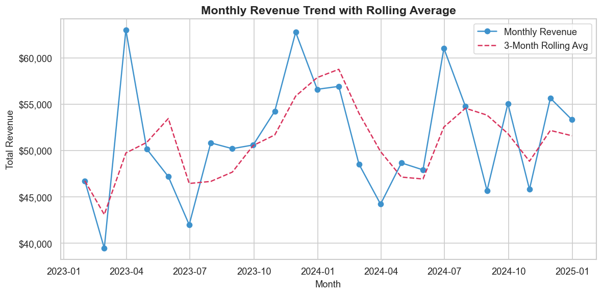
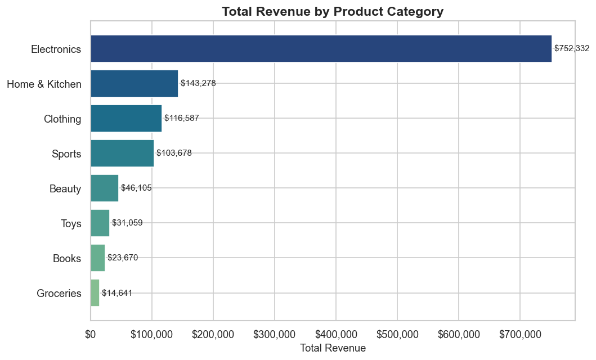
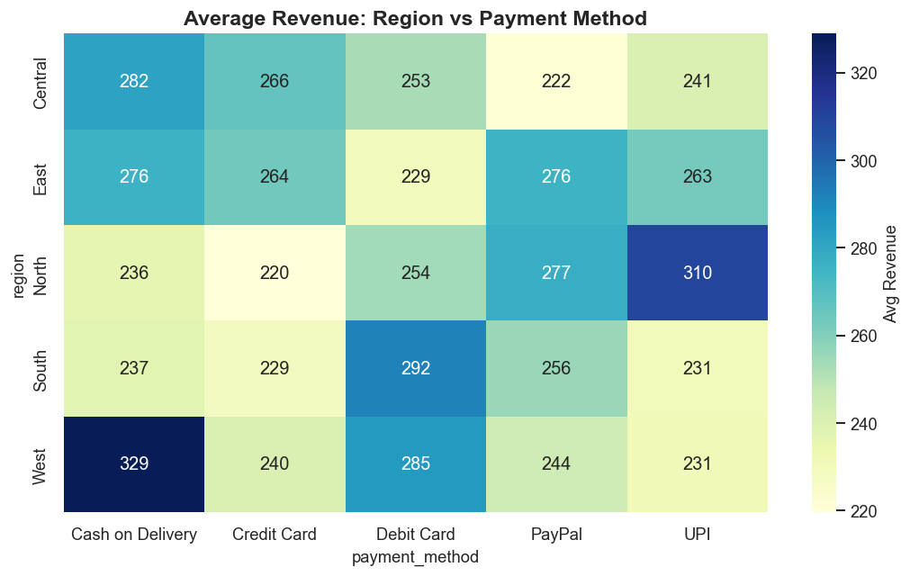
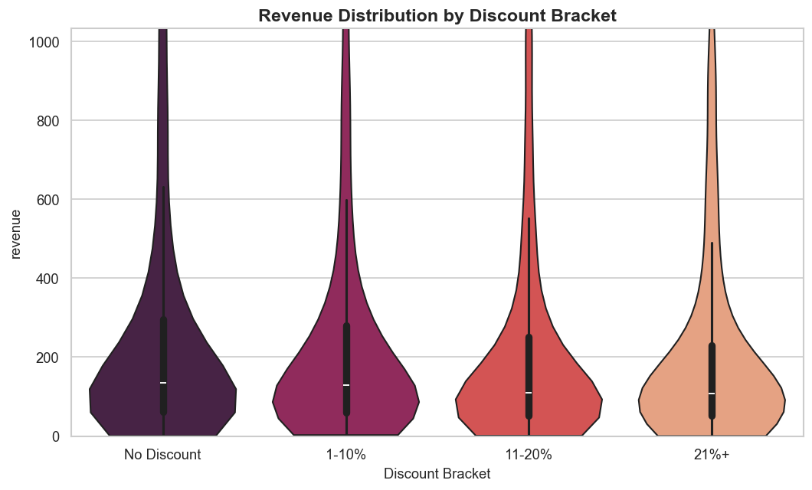
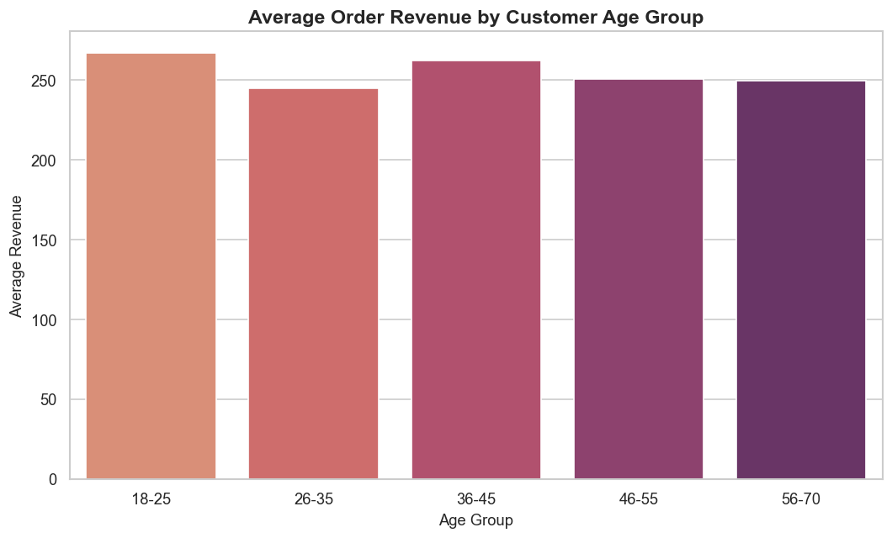
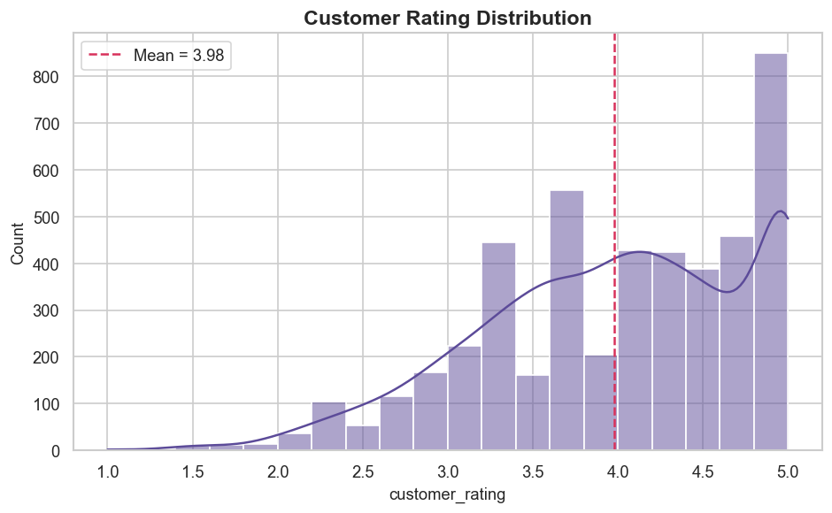
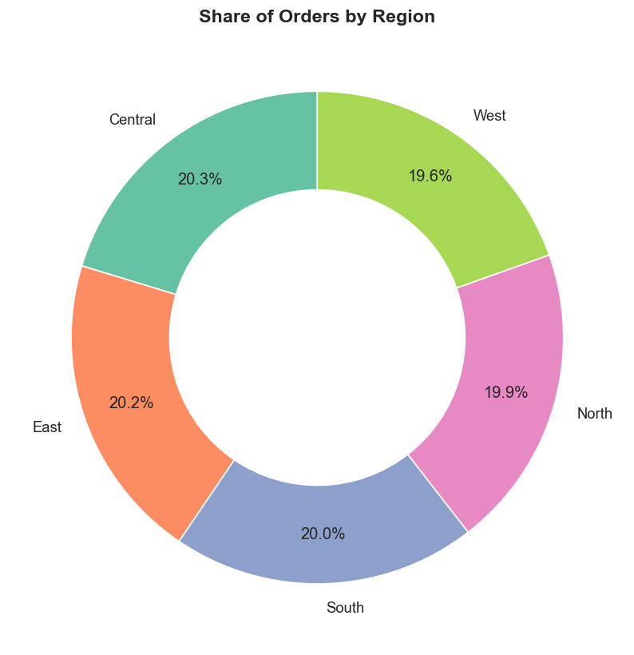

# Data Story: E-Commerce Sales Performance

_Generated on 2026-08-10 20:48:23_

## Executive Summary

Across the analyzed period, **Electronics** emerged as the top-performing category by total revenue, while **Central** generated the highest order volume. The strongest revenue month was **March 2023**. Average customer satisfaction sits at **3.98 / 5**, and average delivery time is **5.0 days**.

## Chart 1 — Revenue Trend

The rolling average smooths out month-to-month noise and makes the underlying growth trajectory visible, which is more decision-useful than raw monthly totals alone.

## Chart 2 — Category Performance

**Electronics** leads total revenue. Category ranking should directly inform inventory investment and promotional budget allocation.

## Chart 3 — Region vs Payment Method

This heatmap surfaces regional payment preferences — useful for prioritizing which payment gateways to optimize per region.

## Chart 4 — Discount Impact

Discount percentage is negatively correlated with revenue (r = -0.058). This should be weighed against margin impact before scaling promotions further.

## Chart 5 — Age Group Spending

Spending varies meaningfully by age bracket, suggesting an opportunity for age-targeted marketing campaigns.

## Chart 6 — Rating Distribution

The average rating of 3.98 / 5 indicates generally positive sentiment, with a distribution worth monitoring for any leftward (lower-rating) shift over time.

## Chart 7 — Regional Order Share

**Central** contributes the largest share of order volume, which should factor into logistics and warehouse placement decisions.

## Recommended Actions

1. Double down on **Electronics** with expanded inventory and featured placement.
2. Investigate why **March 2023** outperformed — replicate the conditions (campaigns, seasonality) if possible.
3. Reassess discount strategy in light of its measured relationship with revenue.
4. Prioritize logistics investment in **Central** given its order volume share.
