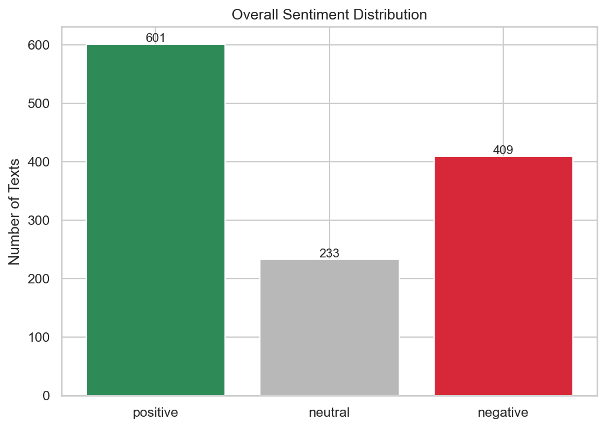
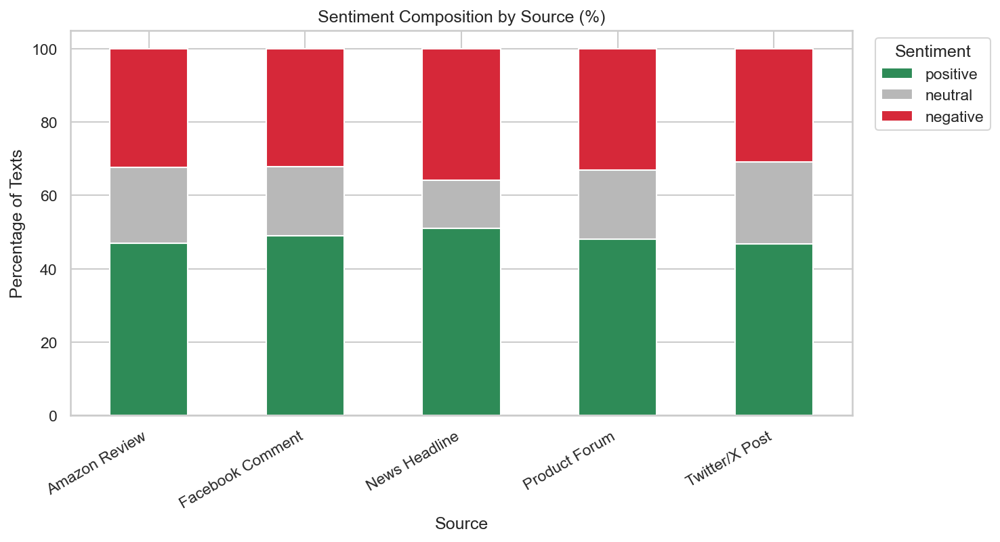
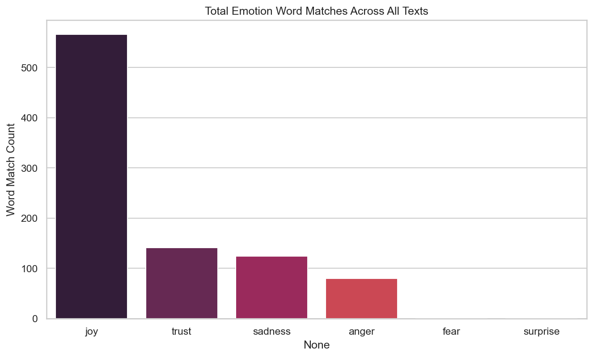
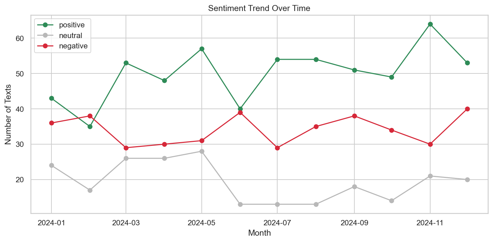
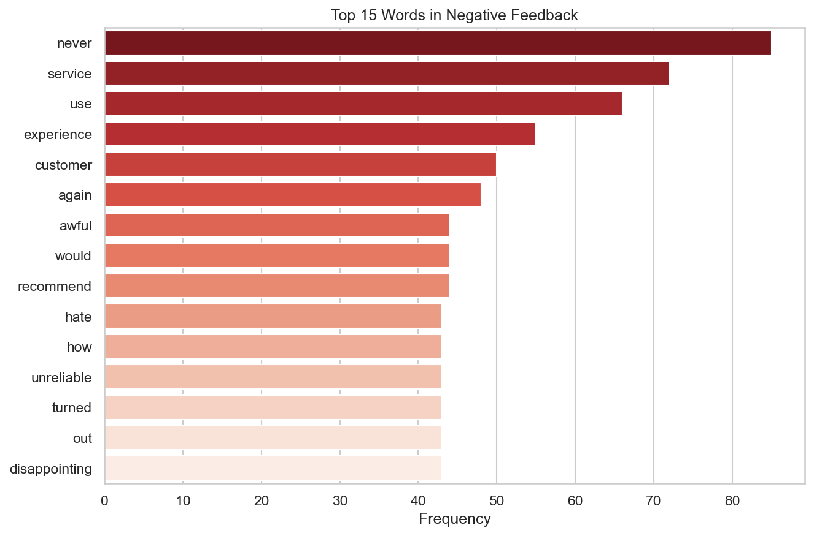

# Sentiment Analysis Report

_Generated on 2026-08-13 08:55:41_

## 1. Overview

- Total texts analyzed: **1243**
- Sources covered: **Amazon Review, Facebook Comment, News Headline, Product Forum, Twitter/X Post**

## 2. Overall Sentiment Breakdown

| Sentiment | Count | Percentage |
|---|---|---|

| Positive | 601 | 48.4% |

| Neutral | 233 | 18.7% |

| Negative | 409 | 32.9% |

## 3. Model Accuracy vs Ground Truth

- Overall accuracy: **78.36%**

| Class | Precision | Recall | F1-score | Support |
|---|---|---|---|---|

| Positive | 0.70 | 0.90 | 0.79 | 469 |

| Neutral | 0.74 | 0.62 | 0.67 | 279 |

| Negative | 0.93 | 0.77 | 0.85 | 495 |

## 4. Dominant Emotions Detected

| Emotion | Total Word Matches |
|---|---|

| Joy | 566 |

| Trust | 141 |

| Sadness | 124 |

| Anger | 80 |

| Fear | 0 |

| Surprise | 0 |

## 5. Sentiment by Source

| source           |   negative |   neutral |   positive |
|:-----------------|-----------:|----------:|-----------:|
| Amazon Review    |       32.4 |      20.7 |       46.9 |
| Facebook Comment |       32.2 |      18.8 |       49   |
| News Headline    |       35.8 |      13.2 |       51   |
| Product Forum    |       33.2 |      18.8 |       48   |
| Twitter/X Post   |       30.9 |      22.4 |       46.7 |

## 6. Visualizations

## 7. Business Insights & Recommendations

- Positive sentiment accounts for **48.4%** of all analyzed text, indicating overall favorable public perception.
- Negative sentiment accounts for **32.9%**; the top negative keywords chart highlights recurring pain points worth investigating.
- The dominant emotion detected overall is **joy**, which should inform tone and messaging in marketing and support communications.
- **kitchen blender** received the most negative mentions and may warrant a quality or service review.